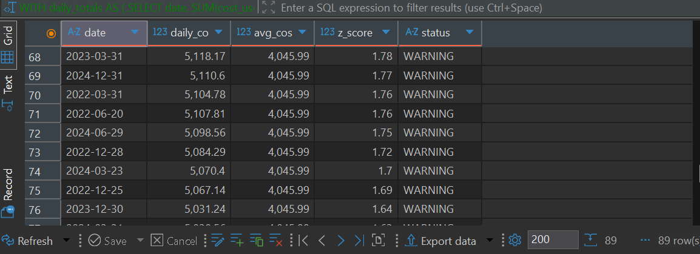
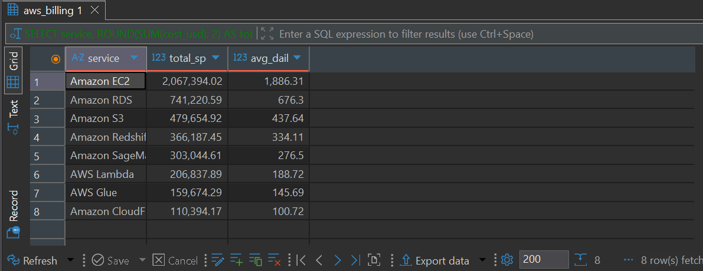

# CloudCleanUp — IT Procurement & Cloud Spend Analytics

**Finding $1.2M+ in annual savings hidden inside a private equity firm's software licenses and cloud bill — using SQL.**

CloudCleanUp analyzes 3 years of IT procurement and cloud-billing data for a 300-person private equity firm to answer the questions most finance and ops teams can't: *Which licenses are we paying for and nobody uses? Why does the cloud bill spike? Where is the money actually going?*

> ⚠️ **All data is simulated.** No real company data was used. The dataset was generated in Python (`data/generate_dataset.py`) to mirror realistic PE-firm procurement and billing patterns.

---

## Key findings

| Finding | Impact |
|---|---|
| **Bloomberg Terminal "ghost" licenses** — assigned, never logged into once | **$864,000 / year** in pure waste |
| **Inactive licenses** — no login in the last 30 days | **~12%** of all assigned licenses |
| **Corporate Finance** — most wasteful department (78 unused licenses) | **$556,920 / year** |
| **AWS vs Azure** — AWS ran ~2x Azure every month, all 3 years | **~$60,000 / month** premium |
| **Billing anomalies** — flagged via z-score detection | **8+ spikes**; worst $8,198 in one day (z = 6.89, 2024-03-01) |
| **Quarter-end pattern** — Mar/Jun/Sep/Dec spend rose with deal activity | Predictable, plannable |
| **Total identifiable annual savings** | **$1.2M+** |

---

## The SQL behind it

Every finding above is produced by a query in [`/sql`](./sql). A few highlights of the techniques used:

**Ghost-license detection — anti-join with `NOT EXISTS`** ([`02_ghost_licenses.sql`](./sql/02_ghost_licenses.sql))
Find licenses that have *zero* matching login activity — assigned but never used once.
```sql
SELECT l.software_name,
       COUNT(l.license_id) AS ghost_licenses,
       ROUND(COUNT(l.license_id) * l.monthly_cost_usd * 12, 2) AS annual_waste_usd
FROM licenses_assigned l
WHERE NOT EXISTS (
    SELECT 1 FROM login_activity la
    WHERE la.employee_id = l.employee_id
      AND la.software_id = l.software_id
)
GROUP BY l.software_name, l.monthly_cost_usd
ORDER BY annual_waste_usd DESC;
```

**Anomaly detection — z-score computed in pure SQL** ([`06_anomaly_detection.sql`](./sql/06_anomaly_detection.sql))
Build a daily baseline, derive variance from `AVG(x²) − AVG(x)²`, then flag days more than 2.5 standard deviations above normal.
```sql
WITH daily_totals AS (
    SELECT date, SUM(cost_usd) AS daily_cost
    FROM aws_billing GROUP BY date
),
stats AS (
    SELECT AVG(daily_cost) AS avg_cost,
           AVG(daily_cost * daily_cost) - AVG(daily_cost) * AVG(daily_cost) AS variance
    FROM daily_totals
)
SELECT d.date,
       ROUND((d.daily_cost - s.avg_cost) / SQRT(s.variance), 2) AS z_score,
       CASE WHEN (d.daily_cost - s.avg_cost) / SQRT(s.variance) > 2.5 THEN 'ANOMALY'
            WHEN (d.daily_cost - s.avg_cost) / SQRT(s.variance) > 1.5 THEN 'WARNING'
            ELSE 'Normal' END AS status
FROM daily_totals d, stats s
WHERE (d.daily_cost - s.avg_cost) / SQRT(s.variance) > 1.5
ORDER BY z_score DESC;
```

**Department waste ranking — `RANK()` window function** ([`04_dept_overspend.sql`](./sql/04_dept_overspend.sql))
```sql
SELECT e.department,
       COUNT(l.license_id) AS unused_licenses,
       ROUND(SUM(l.monthly_cost_usd) * 12, 2) AS annual_waste_usd,
       RANK() OVER (ORDER BY SUM(l.monthly_cost_usd) DESC) AS waste_rank
FROM licenses_assigned l
JOIN employees e ON l.employee_id = e.employee_id
WHERE NOT EXISTS ( ... )
GROUP BY e.department;
```

**Quarter-end spike analysis — `LAG()` for month-over-month change** ([`quarter_end_spikes.sql`](./sql/quarter_end_spikes.sql))
Uses `LAG()` to compute MoM % change and flags fiscal quarter-ends to tie spend back to deal activity.

Techniques used across the project: **CTEs, window functions (`RANK`, `LAG`), correlated subqueries / anti-joins, scalar subqueries for percent-of-total, safe division with `NULLIF`, and statistical computation in SQL.**

---

## Visuals

| AWS vs Azure spend | Anomaly detection | Top AWS services |
|---|---|---|
|  |  |  |

---

## Repo structure

```
CloudCleanUp/
├── data/      # Python dataset generator (simulated procurement + billing data)
├── sql/       # 9 analysis queries, numbered in run order (schema → findings)
├── visuals/   # Charts of the key findings
└── README.md
```

## How to run

```bash
# 1. Generate the simulated dataset
python data/generate_dataset.py

# 2. Build the schema, then run any analysis query (SQLite)
sqlite3 cloudcleanup.db < sql/01_schema.sql
sqlite3 cloudcleanup.db < sql/02_ghost_licenses.sql
```

The queries are written for SQLite but use standard ANSI SQL (CTEs, window functions) that ports easily to PostgreSQL.

---

## Why I built this

I came into data from procurement and operations, where this exact problem — paying for software nobody uses and getting surprised by cloud bills — is a real and expensive headache. I built CloudCleanUp to show I can take a messy, multi-source business problem and turn it into specific, dollar-quantified recommendations a finance or ops leader could act on Monday morning.
